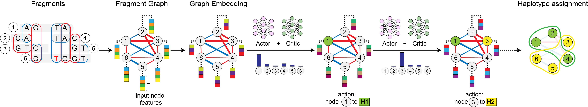

## Deep reinforcement learning framework for haplotype assembly

##### Table of Contents  
[Overview](#overview)  
[Installation](#install)   
[User Guide](#guide)  
[Recommended workflow](#workflow)   

<a name="overview"></a>
### Overview

```ralphi``` is a deep reinforcement learning framework for haplotype
assembly, which leverages a graph convolutional neural network and an actor-critic 
reinforcement learning model to learn the read-to-haplotype assignment algorithm 
based on the maximum fragment cut (MFC) objective. 

<p align="center">

</p>

<a name="install"></a>
### Installation

* Clone the repository:  ```$> git clone git@github.com:PopicLab/ralphi.git```
* ```$> cd ralphi```
* Create new conda environment: ```$> conda create -n ralphi_env python=3.10 pip cxx-compiler```
* Activate the environment: ```$> conda activate ralphi_env```
* Install all the required packages: ```$> pip install -r install/requirements.txt```

* Set the ```PYTHONPATH``` as follows: ```export PYTHONPATH=${PYTHONPATH}:/path/to/ralphi```

<a name="guide"></a>
### User guide

#### Execution

To run: ```$> python engine/phase.py --config </path/to/config>```

```engine/phase.py``` phases an input VCF file given a pre-trained model and an input BAM file.
The script accepts as input a YAML file with configuration parameters. The ```config/``` directory provides 
a sample config file for the ONT platform (```config/ont.yaml```) and the Illumina platform (```config/illumina.yaml```),
which lists the required and key optional parameters.

The key required and optional YAML parameters for phasing are listed below:

* ```vcf``` [*required*] path to the VCF variant file (must be compressed and indexed)
* ```bam``` [*required*] path to the BAM alignment file 
* ```platform``` [*required*] sequencing platform (options: ```illumina``` or ```ONT```) 
* ```reference``` [*required* only for ONT] path to the reference FASTA file used for local realignment
* ```model``` [*required*] path to the pretrained ```ralphi``` model (available under ```data/models```)
* ```chr_names``` [*optional*] list of chromosomes to process: null (all) or a specific list e.g. ["chr1", "chr21"] (default: null)
* ```n_proc```  [*optional*] number of cores to use for phasing (default: 1)
* ```enable_read_selection```  [*optional*] enables Whatshap-based read downsampling (default: true for ONT)
* ```max_coverage```  [*optional*] target coverage for read downsampling (default: 15)
* ```mapq```  [*optional*] minimum alignment mapping quality, reads below this threshold will be removed (default: 20)
* ```filter_bad_reads```  [*optional*] remove low-quality highly-discordant reads (default: true for ONT)

Two models are currently provided in the ```data/models``` directory: 
(1) ralphi.v1.long.pt is recommended for ONT inputs and (2) ralphi.v1.short.pt is recommended for Illumina 
short-read inputs.

```ralphi``` will output results in the parent directory of the YAML config file. The results include the phased VCF
files for each input chromosome (under ```output/```; e.g. ```output/chr1.ralphi.vcf```) and execution logs.

<a name="workflow"></a>
#### Recommended workflow 

1. Create a new directory.
2. Copy the appropriate YAML config from the ```config/``` folder into this directory.
3. Populate the YAML config file with the parameters specific to this experiment.
4. Run the ```phase.py``` script providing the path to the newly configured YAML file.

```ralphi``` will automatically create auxiliary directories with results in the folder where the config 
YAML files are located.
